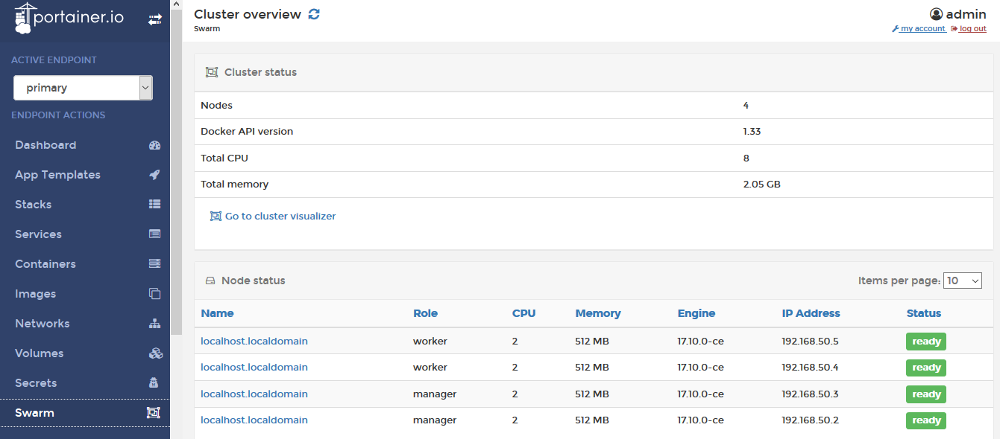

# Running Docker Swarm with Ansible and Vagrant

### 1. start VMs with Vagrant
```sh
vagrant up
```

### 2. install Docker enviroment(Docker Swarm as well) with Ansible
```sh
ansible-playbook -i inventory playbook.yml
```

### 3. land Portainer dashboard 
http://192.168.50.2:9000

